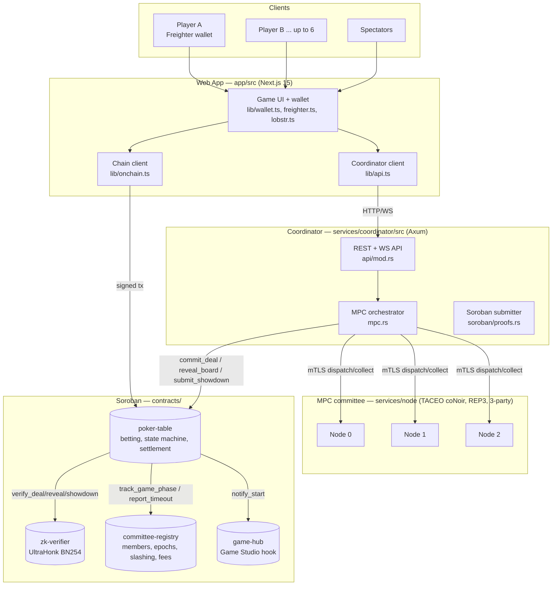
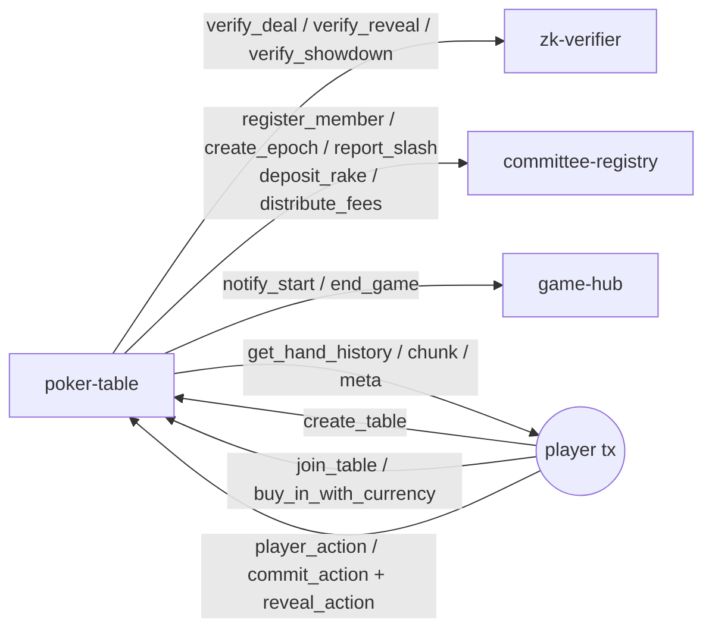
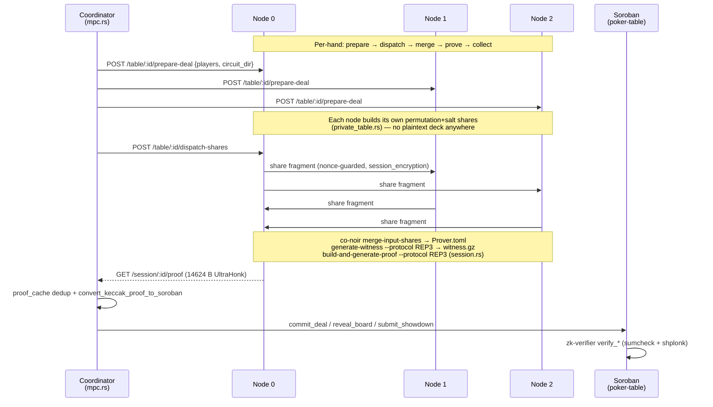
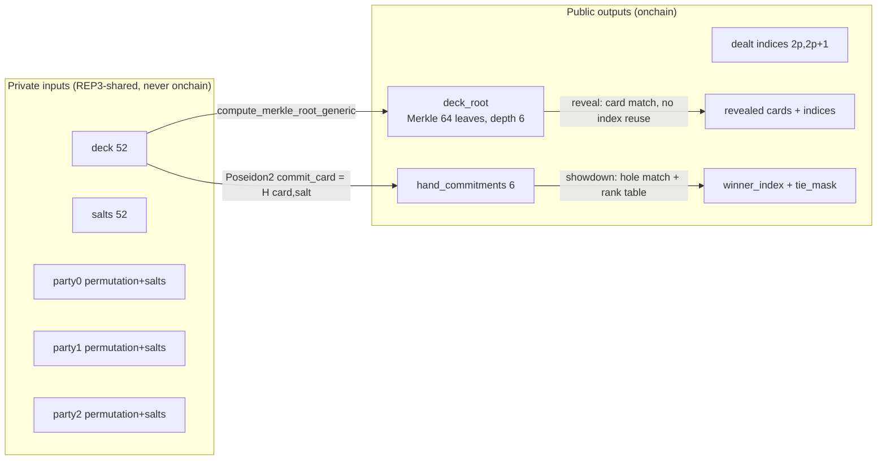
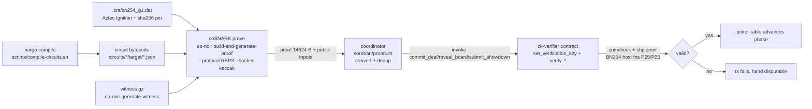

# StellPoker System Architecture

Onchain Texas Hold'em on Stellar with cryptographically private cards (ZK-MPC / coSNARKs).
No single party — coordinator, node, or player — ever sees the full deck.

> Related docs: [hand lifecycle](docs/hand-lifecycle.md) (end-to-end sequence),
> [ZK proof pipeline](docs/zk-proof-pipeline.md) (Noir → UltraHonk → Soroban),
> [commit-reveal](docs/commit-reveal-scheme.md), [MPC session encryption](docs/mpc-session-encryption.md),
> [committee setup](docs/committee-setup.md), [CRS verification](docs/crs-verification.md).

## 1. System overview

Key properties:

- **Private cards** — the deck exists only as REP3 secret shares across the 3 nodes
  (`services/node/src/private_table.rs`, `session.rs`). Privacy holds if ≥2 nodes are honest.
- **ZK-verified** — every deal, board reveal, and showdown carries an UltraHonk proof
  verified onchain by `zk-verifier` via Protocol 25/26 BN254 host functions.
- **Trustless settlement** — bets, pots (`contracts/poker-table/src/pot.rs`), and payouts
  settle in `poker-table`; the coordinator only relays proofs, it cannot forge them.

## 2. Contract flow

`poker-table` state machine (`contracts/poker-table/src/types.rs`, `GamePhase`):
`Waiting → Dealing → Preflop → DealingFlop → Flop → DealingTurn → Turn →
DealingRiver → River → Showdown → Settlement` (+ `Dispute`, `AwaitingRunItTwice`,
`ShowdownRun1/2`, `RitSettlement`). Entry points: `create_table`, `join_table`,
`start_hand`, `commit_deal`, `player_action` (`betting.rs:process_action`),
`reveal_board`, `submit_showdown` (`game.rs:settle_showdown`, `pot.rs:distribute_pots`),
`cancel_hand`, `rit_opt_in`.

## 3. MPC lifecycle

Reveal/showdown reuse the same pattern with
`prepare-reveal/:phase` and `prepare-showdown` (see `services/node/src/api.rs`).
Coordinator routes (`services/coordinator/src/main.rs`): `request-deal`,
`request-reveal/:phase`, `request-showdown`, `player-action`, `rit-opt-in`.
Committee economics (epochs, slashing, fee split) live in `committee-registry`
(see `docs/committee-fee-distribution.md`, `docs/threshold-committee-signing.md`).

## 4. Card commitment scheme

- `commit_card = Poseidon2(card, salt)` (`circuits/lib/src/commitments.nr`);
  `commit_hand = H(c1, c2)`, Omaha `H(H(c1,c2),H(c3,c4))`.
- `deck_root` = Merkle root over 64 leaves (52 cards + padding), depth 6.
- Deal (`circuits/deal_valid`): proves the deck is a valid 52-card permutation,
  the root matches, and each `hand_commitments[i]` matches dealt cards `2p, 2p+1`.
- Reveal (`circuits/reveal_board_valid`): proves revealed cards match the committed
  deck and no index is reused (`previously_used_indices[16]`).
- Showdown (`circuits/showdown_valid`): proves hole cards match commitments, hand
  evaluation against the rank table is correct, and `winner_index`/`tie_mask` are right.
- Player *actions* use a separate hash commit-reveal
  (`Keccak(action||amount||nonce)`, `contracts/poker-table/src/commit_reveal.rs`).

## 5. Proof verification pipeline

Stages: Noir compilation (`nargo 1.0.0-beta.17`) → CRS (`scripts/download-crs.sh`,
pinned in `scripts/crs.sha256`) → witness (`generate-witness --protocol REP3`) →
UltraHonk proving (Barretenberg `bb`, keccak hasher) → serialization
(14624 B proof + field elements as hex/Bytes) → Soroban verification
(`zk-verifier`, vendored verifier in `vendor/ultrahonk-rust-verifier`) →
coordinator submission with retry + `proof_cache` dedup. Full detail in
[docs/zk-proof-pipeline.md](docs/zk-proof-pipeline.md).
