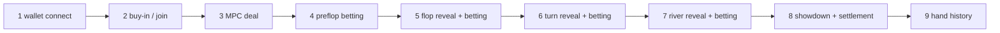
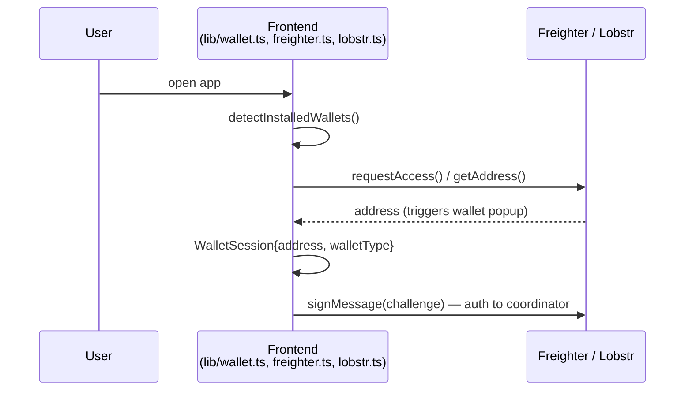
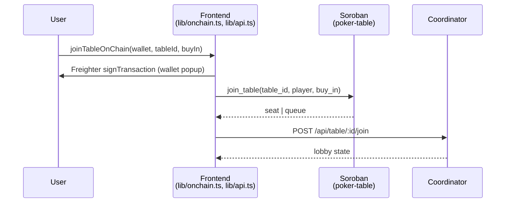
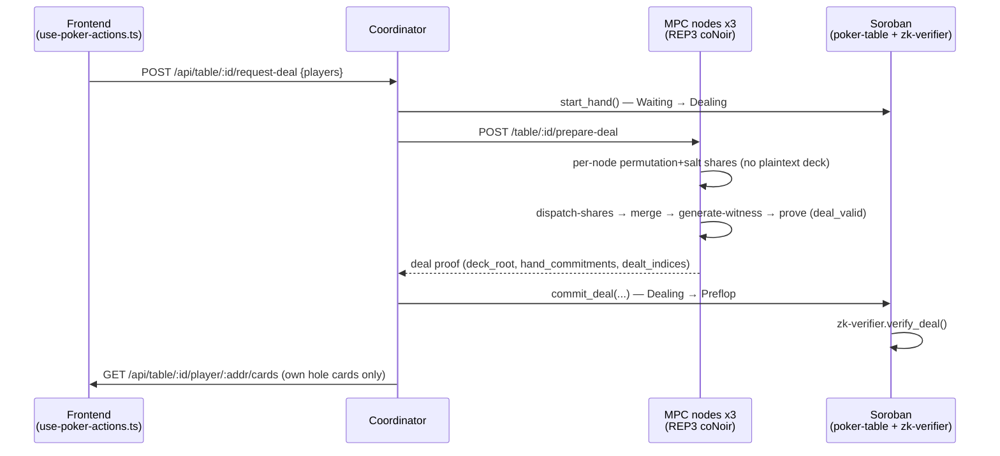
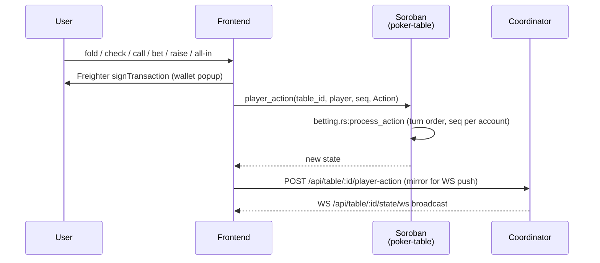
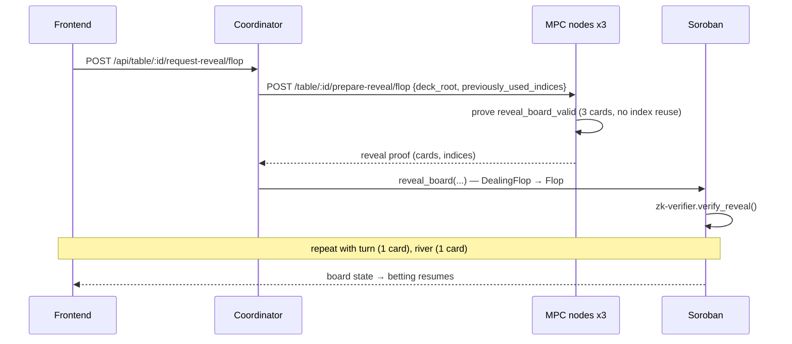
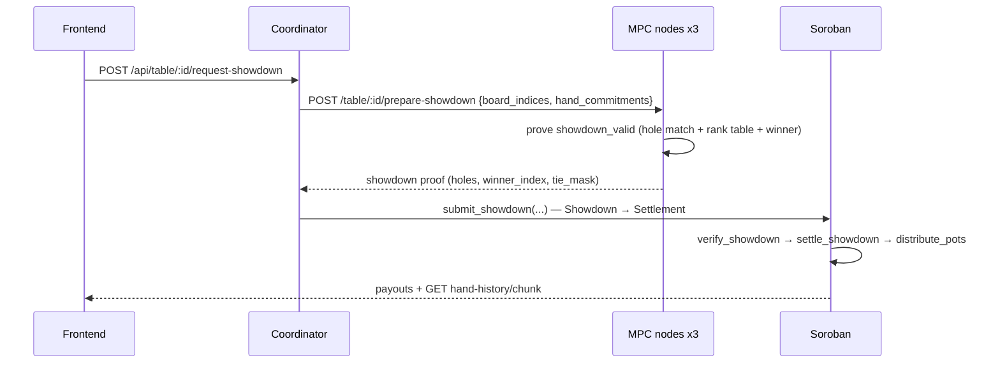

# Hand Lifecycle — Deal to Showdown (End to End)

Step-by-step trace of one hand, from wallet connect to pot settlement.
For the static view see [ARCHITECTURE.md](../ARCHITECTURE.md);
for proof internals see [zk-proof-pipeline.md](zk-proof-pipeline.md).

Phases (`contracts/poker-table/src/types.rs`, `GamePhase`):
`Waiting → Dealing → Preflop → DealingFlop → Flop → DealingTurn → Turn →
DealingRiver → River → Showdown → Settlement` (plus `Dispute`, `AwaitingRunItTwice`).

## 0. Overview

## 1. Wallet connect

Frontend: `detectInstalledWallets`, `connectWallet`, `trySilentReconnect`
(`app/src/lib/wallet.ts`); Freighter calls in `lib/freighter.ts`
(`connectFreighterWallet`, `getActiveAddress`); Lobstr in `lib/lobstr.ts`.
Coordinator wallet challenge: `getWalletChallenge` / `verifyWalletChallenge`
(`lib/api.ts`).

## 2. Buy-in / join

- Onchain escrow: `join_table` / `buy_in_with_currency` (`contracts/poker-table`).
- Offchain lobby mirror: `POST /api/table/:id/join`, `GET /api/table/:id/lobby`
  (`services/coordinator/src/api/mod.rs`, `join_table`, `get_table_lobby`).
- Table creation (admin): `create_table` onchain + `POST /api/tables/create`
  (`createTable` in `lib/api.ts`). Partial top-ups between hands:
  see `docs/poker-table-rebuys.md`.

## 3. MPC deal

Circuit: `circuits/deal_valid` (per-player-count variants `deal_valid_2p..6p`).
Public: `deck_root`, `hand_commitments[6]`, dealt indices; private (shared):
`deck[52]`, `salts[52]` as 3 party shares + `vrf_sk`.
Frontend hook: `usePokerActions` (`lib/use-poker-actions.ts`); private cards via
`getPlayerCards` (`lib/api.ts`).

## 4. Betting rounds

All-in/fold early end: `settle_fold_win` without showdown.
Multi-table: submissions are sequenced per account (`docs/multi-table-play.md`).
Optional action-hiding: `commit_action` + `reveal_action`
(`docs/commit-reveal-scheme.md`).

## 5. Board reveals (flop / turn / river)

Circuit: `circuits/reveal_board_valid` (max 3 cards per call; turn/river reveal 1).
`requestReveal` in `lib/api.ts`; coordinator `request_reveal` handler.

## 6. Showdown and settlement

Circuit: `circuits/showdown_valid` (+ `2p..6p`, Omaha variants).
Settlement: `game.rs:settle_showdown`, `pot.rs:distribute_pots(_with_ties)`,
`submit_showdown` records `bad_beat_scores` where applicable.
Run-it-twice: `rit_opt_in → ShowdownRun1/2 → RitSettlement`.
Timeouts/disputes: `committee-registry:track_game_phase/report_timeout`,
`poker-table:cancel_hand` (`GamePhase::Dispute`).

## 7. After the hand

- Next hand: `start_new_hand` reuses escrowed stacks; players top up via rebuy band.
- History: last 16 settled hands per table in a circular buffer —
  `get_hand_history` / `get_hand_history_chunk` / `get_hand_history_meta`
  (`docs/poker-table-hand-history.md`); coordinator `GET .../hand-history/chunk`;
  local mirror in `lib/hand-history.ts`, export via `lib/hand-history-export.ts`.
