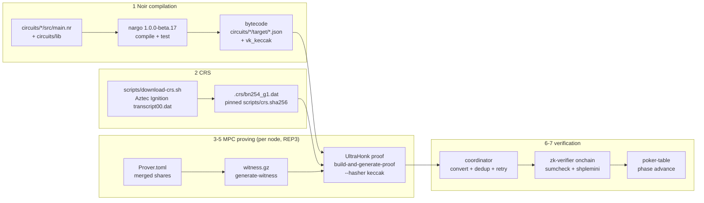

# ZK Proof Generation and Verification Pipeline

How proofs flow: Noir compilation → CRS → witness → UltraHonk proving →
serialization → Soroban verification → coordinator verification.
Companion docs: [ARCHITECTURE.md](../ARCHITECTURE.md) (§5),
[hand lifecycle](hand-lifecycle.md), [CRS verification](crs-verification.md),
[proof edge cases](proof-verification-edge-cases.md).

## 1. Noir compilation

- Toolchain: `nargo 1.0.0-beta.17` (`noirup -v 1.0.0-beta.17`).
- Script: `scripts/compile-circuits.sh` — runs `nargo compile --program-dir`
  for every circuit and `nargo test` in `circuits/lib`; per-player-count variants
  are stamped with `PLAYER_COUNT=2..6` (`deal_valid_2p..6p`, `showdown_valid_2p..6p`).
- Outputs per circuit (`circuits/<name>/target/`): bytecode `<name>.json`
  (fed to `bb` / co-noir) and `vk_keccak` (keccak-hasher verification key,
  embedded onchain via `zk-verifier:set_verification_key`).
- Circuits: `deal_valid`, `reveal_board_valid`, `showdown_valid` (+ Omaha,
  shoe, `burn_card_valid`, `side_pot_valid`, `fold_valid`, `deck_complete`, …);
  shared gadgets in `circuits/lib/src/` (cards, Poseidon2 commitments, Merkle,
  shuffle, VRF, rank table, pot). Budgets enforced in CI
  (`.github/workflows/circuit-benchmarks.yml`, `circuits/constraint-budgets.json`).

## 2. CRS generation / download

- File: `.crs/bn254_g1.dat` — BN254 G1 structured reference string from the
  Aztec Ignition ceremony (`transcript00.dat`), fetched by
  `scripts/download-crs.sh` (run before `compile-circuits.sh`).
- Integrity: pinned SHA-256 in `scripts/crs.sha256` + `.crs/checksums.sha256`;
  `--verify-only` fails hard on mismatch (see `docs/crs-verification.md`).
- The same CRS file must be present on the coordinator and **all three** MPC
  nodes; it is passed as `--crs <crs_file>` to every prove invocation.

## 3. Witness computation (inside MPC)

Private inputs (deck, salts) never leave the secret-shared domain:

1. `prepare-deal / prepare-reveal / prepare-showdown` — each node builds its own
   permutation + salt shares (`services/node/src/private_table.rs`).
2. `dispatch-shares` — nodes exchange nonce-guarded fragments
   (`session.rs:receive_share_fragment`, `crypto/session_encryption.rs`).
3. `co-noir merge-input-shares --out Prover.toml --protocol REP3`.
4. `co-noir generate-witness --protocol REP3` → `witness.gz`
   (`services/node/src/session.rs`). Witness buffers are zeroized after use.

## 4. UltraHonk proving (coSNARK)

- Command (per node, 3 retries): `co-noir build-and-generate-proof
  --circuit <dir>/target/<name>.json --witness witness.gz --protocol REP3
  --crs <crs_file> --hasher keccak --vk <dir>/target/vk_keccak --out proof
  --public-input ... --fields-as-json` (`services/node/src/session.rs`).
- Backend: Barretenberg UltraHonk over BN254. Reference timings:
  deal ~50–60 ms, reveal ~45–55 ms, showdown ~150–180 ms (see README).
- Public inputs per circuit: deal → `deck_root, hand_commitments, dealt indices`;
  reveal → `deck_root, cards, indices`; showdown → `hand_commitments,
  board_indices, deck_root, winner_index, tie_mask`.

## 5. Proof serialization

- Wire size: **14624 bytes** (`PROOF_BYTES` in `contracts/zk-verifier/src/lib.rs`).
- Node returns fields-as-JSON; the coordinator converts with
  `convert_keccak_proof_to_soroban`, `public_inputs_to_hex`,
  `field_to_bytes32_hex` (`services/coordinator/src/soroban/proofs.rs`)
  into Soroban `Bytes` + fixed-index public-input vectors:
  deal (`DEAL_BYTES`: idx 1 = root, 2+ = hands), reveal (`REVEAL_BYTES`:
  idx 0 = root, 19+ = cards, 22+ = indices), showdown (`SHOWDOWN_BYTES`:
  0 = n, 1–7 = hands, 7–12 = board, 12 = root, 25 = winner, 26 = tie).
- `proof_cache.rs` dedups by `proof_key` so retries never double-submit.

## 6. Soroban verification

- Contract: `contracts/zk-verifier/src/lib.rs` — `initialize`,
  `set_verification_key(circuit, vk_data)`, `verify_proof(circuit, proof,
  public_inputs) -> bool`, typed `verify_deal / verify_reveal / verify_showdown`,
  `is_proof_verified`. Crypto: `UltraHonkVerifier::verify` (sumcheck + Shplemini
  opening) in `vendor/ultrahonk-rust-verifier` (`verifier.rs`, `sumcheck.rs`,
  `shplemini.rs`, `ec.rs`, `transcript.rs`), using Protocol 25/26 native BN254
  host functions (curve ops, MSM, Poseidon2); without them verification would
  exceed the Soroban instruction budget (`docs/soroban-budget-profiling.md`).
- Callers: `poker-table:commit_deal → verify_deal`, `reveal_board →
  verify_reveal`, `submit_showdown → verify_showdown` (`verifier.rs:ZkVerifierClient`).
  A failed verification fails the transaction; the hand stays in its `Dealing*`
  phase and is disputable (`cancel_hand`, `report_timeout`).
- Failure modes (tampered proof, wrong VK, PI mismatch, budget overrun):
  see `docs/proof-verification-edge-cases.md`.

## 7. Coordinator verification / submission

- `services/coordinator/src/soroban/proofs.rs`: `submit_deal_proof →
  commit_deal`, `submit_reveal_proof → reveal_board`, `submit_showdown_proof →
  submit_showdown` via `invoke_contract_with_retries` (`soroban/mod.rs`);
  `maybe_start_hand_for_deal → start_hand` before dealing.
- The coordinator performs **no independent proof check** beyond byte-size/shape
  conversion and cache dedup — onchain `zk-verifier` is the trust root, so a
  malicious coordinator cannot forge a hand. Node liveness is tracked via
  `/api/node/register`, heartbeats, and `NODE_UNAVAILABLE` markers (`mpc.rs`).
